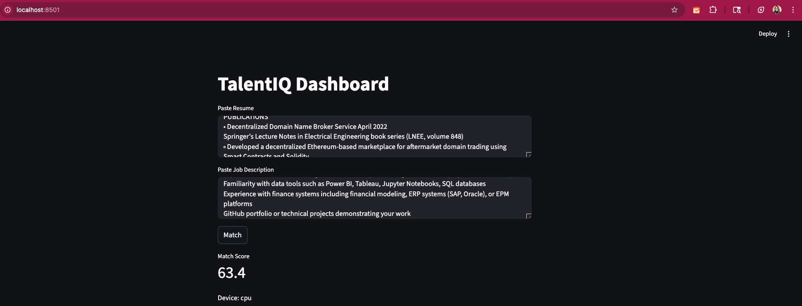

# TalentIQ – AI Talent Intelligence Platform - Deployed URL (https://talentiq-platform.streamlit.app/)

Enterprise-grade ML system for resume-job matching.

## Features

- Transformer embeddings
- GPU acceleration
- REST APIs
- SaaS dashboard
- Audit logging
- Bias monitoring
- Docker support

## Tech

FastAPI, PyTorch, NLP, Docker, Streamlit, SQLAlchemy

## Run

pip install -r requirements.txt
uvicorn app.main:app --reload

streamlit run dashboard/app.py

